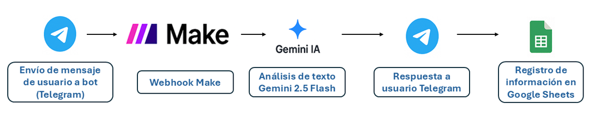
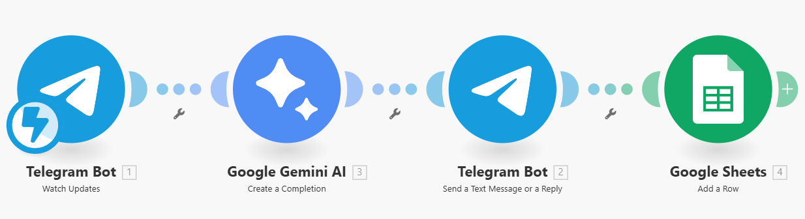

# 🧩 Automatización de Asignación de Tickets de Soporte con IA

## 📘 Descripción general
Este proceso desarrollado en **Make** automatiza la **asignación de tickets de soporte técnico** usando **inteligencia artificial (Gemini 2.5 Flash)**.  
El flujo permite que los usuarios reporten incidencias a través de **Telegram**, donde el bot analiza automáticamente la descripción del problema y **determina el nivel de soporte (N1–N4)** más adecuado.  
Cada solicitud se **registra en un archivo de Google Sheets**, manteniendo un control centralizado y en tiempo real de todas las incidencias.

---

## 🎯 Objetivo
Optimizar y agilizar el proceso de registro y clasificación de incidencias de TI, reduciendo la carga de trabajo manual y mejorando los tiempos de respuesta al usuario final.

---

## ⚙️ Flujo general del proceso
1. **Recepción del ticket:**  
   Un usuario envía un mensaje al **bot de Telegram** describiendo su incidencia.  
2. **Procesamiento con IA:**  
   El texto es analizado por el modelo **Gemini 2.5 Flash**, que clasifica la incidencia en un nivel de soporte:
   - **N1:** Soporte básico / primera línea  
   - **N2:** Soporte avanzado  
   - **N3:** Soporte especializado  
   - **N4:** Soporte externo o de terceros  
3. **Registro automático:**  
   Los datos del ticket (Nombre, username, incidencia, fecha, asignado o no y nivel asignado) se guardan automáticamente en una **hoja de Google Sheets**.  
4. **Respuesta al usuario:**  
   El bot envía un mensaje de confirmación indicando que la solicitud ha sido recibida y asignada correctamente.

---

## 🧠 Módulos utilizados

### 1. 🔔 **Watch Updates (Telegram Bot)**
- **Función:** Detecta automáticamente los mensajes enviados al bot de Telegram mediante un webhook.  
- **Salida principal:** Contiene el texto del mensaje y los datos del usuario que envió la incidencia.  
- **Configuraciones clave:**  
  - Bot Token (conexión con Telegram que se realiza directo en la app)  
  - Tipo de actualización: *Envío de mensajes (Ahora trabaja solo con texto)*  
  - Webhook configurado automáticamente por Make  

---

### 2. 🤖 **Create a Completion (Google Gemini AI)**
- **Función:** Analiza la descripción de la incidencia y determina el nivel de soporte más adecuado.  
- **Modelo utilizado:** `gemini-2.5-flash`  
- **Prompt principal:**  

_"Clasifica esta incidencia de soporte de TI en uno de estos niveles: N1, N2, N3 o N4, según su complejidad del mensaje descrito por el usuario. Devuelve SOLO el código de nivel. Mensaje: **{{message.text}}**_

_A continuación te dejo una breve descripción referente a los niveles de soporte para que lo consideres cuando categorices una incidencia: el Nivel 1 para consultas básicas (soporte básico), Nivel 2 para problemas técnicos más complejos, Nivel 3 para soporte experto y Nivel 4 para incidencias muy especializadas que pueden requerir intervención externa"_
- **Ventajas del modelo:**
    - Accesible y rápido
    - Permite su uso a un muy bajo costo
    - Integración nativa con Make

### 3. 💬 Send a text Message or a Reply (Telegram Bot)
- **Función:** Envía una respuesta automática y al instante al usuario en Telegram
- **Contenido del mensaje:** _"Hola **{{nombre}}**, hemos recibido tu mensaje. De acuerdo a tu incidencia te vamos a asignar al canal de soporte nivel: **{{nivel}}**"_  
- **Configuraciones clave:** 
    - Chat ID: Obtenido del módulo Watch Updates
    - Texto: Respuesta dinámica basada en el resultado del modelo Gemini
### 4. 📗 Add a Row (Google Sheets)
- **Función:** Registra los datos del ticket en una hoja de cálculo
- **Campos registrados**: Nombre, username, Inicidencia, Fecha, Observaciones, Atendido, Asignado a.
- **Configuraciones clave:** 
    - Conexión: Habilitar API desde Consola y generar conexión nativa con Make.
    - Archivo: Archivo alojado en una carpeta en cuenta de Drive de Google
    - Hoja: Hoja con las columnas necesarias para registrar información
---

### Arquitectura actual

---

### Flujo en Make

---

### 🧩 Resultado esperado
- Los usuarios pueden generar tickets directamente desde Telegram
- Cada ticket se clasifica automáticamente con ayuda de la IA
- Se guarda un registro organizado y actualizado en Google Sheets
- El usuario recibe confirmación inmediata
---
### 🫴 Beneficios principales
- ✔️ **Ahorro de tiempo:** elimina la clasificación manual de tickets
- ✔️ **Mejor experiencia del usuario:** respuesta instantánea
- ✔️ **Centralización:** todas las incidencias quedan registradas automáticamente
- ✔️ **Escalabilidad:** se pueden agregar nuevos canales o reglas de clasificación
---
### 🤓 Próximos pasos o mejoras
- Enviar notificaciones por correo o mediante un canal de Slack al equipo de soporte asignado
- Integrar seguimiento de tickets (Abierto, En proceso, Cerrado)
- Entrenar un modelo de IA con ejemplos de incidencias de un proyecto específico para mejorar la precisión